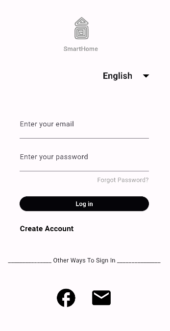
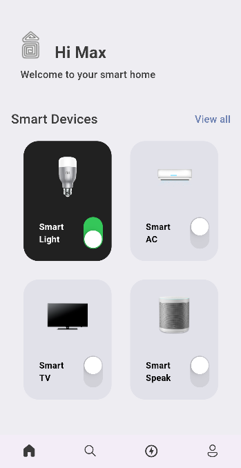
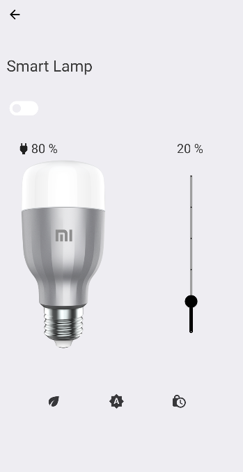

# smart_home

This project is about a mobile application of a smart home for university assignment .

## Getting Started

- When you first start this application it will ask you to login, so a login page will be created and a register page. 

- After you login you be guided to the main screen, there you can choose to add a room and smart devices as many you want you can recreate your own house in this application. 

- Then there will be some navigation bar on the bottom or on top that will guide you through your rooms. 

- The home page will have a puzzle like look, each piece of the puzzle will be a room of your house. 

- The user will also have a profile page that will inspect his information and change it if he wants. 

- The users will controll their whole house through an app and everything will be organized in rooms. He will have copy of his house on his phone.

